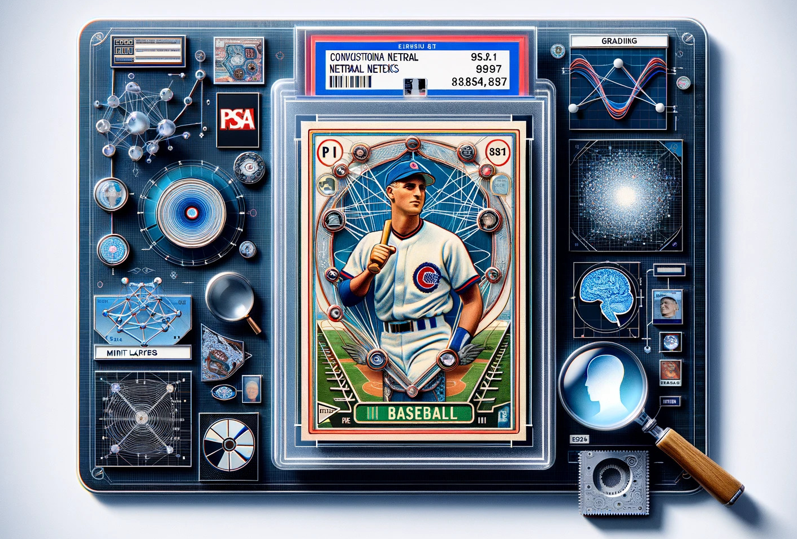

    

<h1 align="center">Automated Grading of Baseball Trading Cards using Convolutional Neural Networks</h1>  

# Table of contents
- [Project Takeaway](#Project-Takeaway)
- [Exploratory Data Analysis](#Exploratory-Data-Analysis)
- [Data Collection](#Data-Collection)
- [Data Cleaning](#Data-Cleaning)
- [Data Standardization and Augmentation](#Data-Standardization-and-Augmentation)
- [Neural Network Model Building](#Neural-Network-Model-Building)
- [Model Evaluation](#Model-Evaluation)
- [Descriptions of Files in Repo](#Descriptions-of-Files-in-Repo)

# Project Takeaway
For my masters capstone I built a neural network to automate the manual card grading process done by companies such as [PSA](https://www.psacard.com/services/tradingcardgrading). Card holders now no longer need to ship their valuable cards off and pay top prices for a manual professional grade. This model allows users to get instanteneous card grades from just a snap of their phone camera.

 - The model performed well, assigning new cards a grade score with 76% accuracy, with a variance of +/- 1.2 grades.
 - The model was trained on 10k labeled images with professional scores from PSA, which underwent rigorous cleaning: image selection, image cropping, and image augmentation.
 - I built my model on top of the pre-trained RESNET-50 model, the gold standard convolutional neural network for image classification.
 - Key parameters optimized performance including: number of dense layers, pooling method, activation functions, frozen layers, batch size, learning rate, and dropout rate.

Using this model, I founded **Card Grade AI, LLC** Our app allows users to get instant card grades, and host a virtual portfolio of their collection. It is currently in progress. For this reason the training data and final ML model are not on this repo, and are considered proprietary.

All 10k cards were scraped from [Collectors.com](https://www.collectors.com/trading-cards/sport-baseball-cards/20003?lowgrade=1&highgrade=10&gradingservice=2&page=1) using beautiful soup

# Exploratory Data Analysis

# Data Collection

# Data Cleaning

# Data Standardization and Augmentation

# Neural Network Model Building

- ResNet-50 feeds into three fully connected ReLU dense layers [1024, 512, 128]  
- The dense layers feed into a single softmax prediction layer  

Two rounds of training were done:
- First Round: 15 epochs, freeze first 20 layers of ResNet-50
- Second Round: 15 epochs, unfreeze all layers
  

# Model Evaluation

The condition of a trading card significantly influences its worth. However, the current methods to assess a card's condition are insufficient. Non-professionals often lack the accuracy required for card grading, and obtaining professional evaluations is too expensive and time-consuming.

This project aims to automate the card grading process using machine learning. Our neural network utilizes the pretained model ResNet-50 
combined with custom classification and output layers. 

# Descriptions of Files in Repo

