

    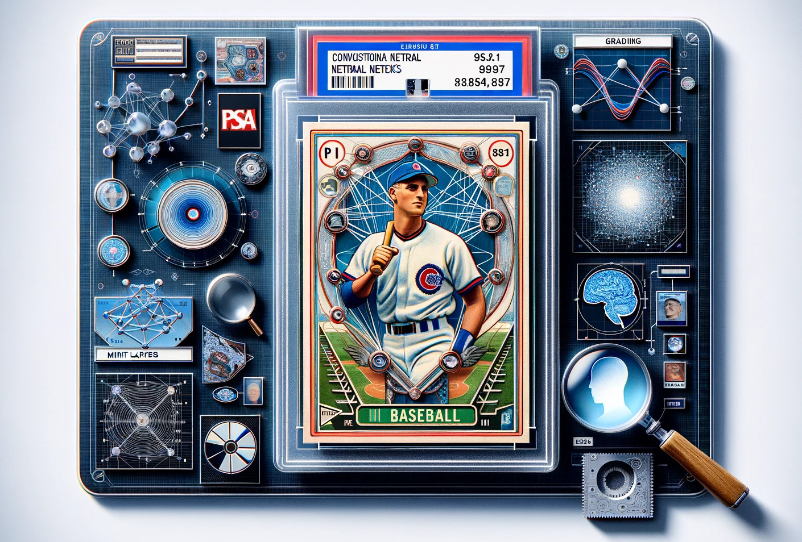

<h1 align="center">Automated Grading of Baseball Trading Cards using Convolutional Neural Networks</h1>  

# Table of contents
- [Project Takeaway](#Project-Takeaway)
- [Data Collection](#Data-Collection)
- [Data Cleaning](#Data-Cleaning)
- [Data Standardization and Augmentation](#Data-Standardization-and-Augmentation)
- [Neural Network Model Building](#Neural-Network-Model-Building)
- [Exploratory Data Analysis](#Exploratory-Data-Analysis)
- [Descriptions of Files in Repo](#Descriptions-of-Files-in-Repo)

# Project Takeaway
For my masters capstone I built a neural network to automate the manual card grading process done by companies such as [PSA](https://www.psacard.com/services/tradingcardgrading). Card holders now no longer need to ship their valuable cards off and pay top prices for a manual professional grade. This model allows users to get instanteneous card grades from just a snap of their phone camera.

 - The model performed well, assigning new cards a grade score with 76% accuracy, with a variance of +/- 1.2 grades.
 - The model was trained on 10k labeled images with professional scores from PSA, which underwent rigorous cleaning: image selection, image cropping, and image augmentation.
 - I built my model on top of the pre-trained RESNET-50 model, the gold standard convolutional neural network for image classification.
 - Key parameters optimized performance including: number of dense layers, pooling method, activation functions, frozen layers, batch size, learning rate, and dropout rate.

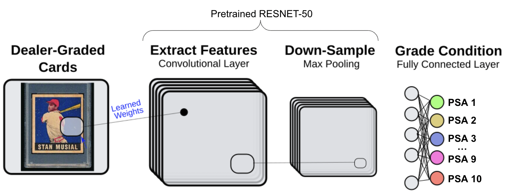

Using this model, I founded **Card Grade AI, LLC** Our app allows users to get instant card grades, and host a virtual portfolio of their collection. It is currently in progress. For this reason the training data and final ML model are not on this repo, and are considered proprietary.

All 10k cards were scraped from [Collectors.com](https://www.collectors.com/trading-cards/sport-baseball-cards/20003?lowgrade=1&highgrade=10&gradingservice=2&page=1) using beautiful soup

# Data Collection
Example of professsionally graded card for sale on Amazon:  
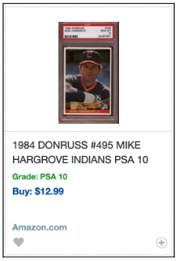  

Summary of where data was scraped from:
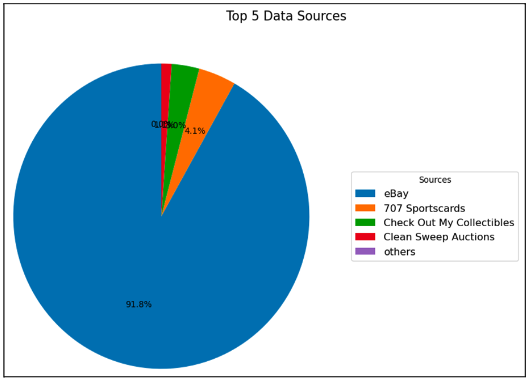

# Data Cleaning
Manual image selection was done for all 20k images, yeilding 10k that were used during training. This took a few tedious hours, but was definetely worth the effort.   

Examples of images before manual selection:
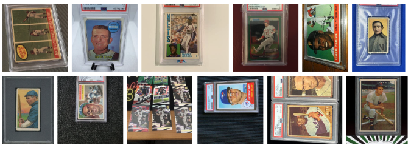  

Examples of images after manual selection:
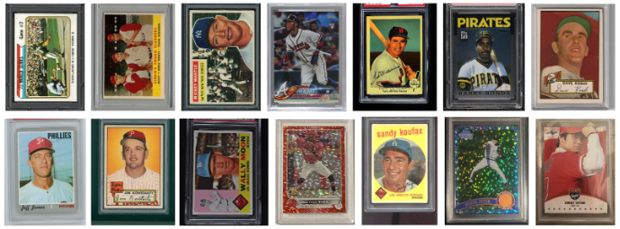  

# Data Standardization and Augmentation
As part of standarization, the quality scores were cropped out of the image:  
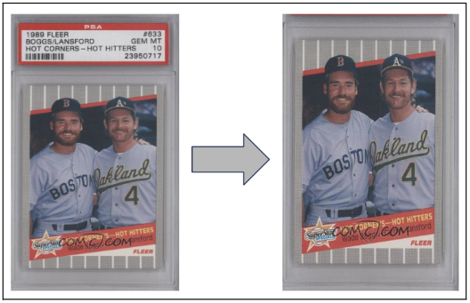  

Providing the CNN model with both original and flipped images yielded the best results:  
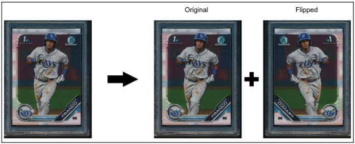  

Finally, balancing the data across outcome categories was performed, removing training bias.  
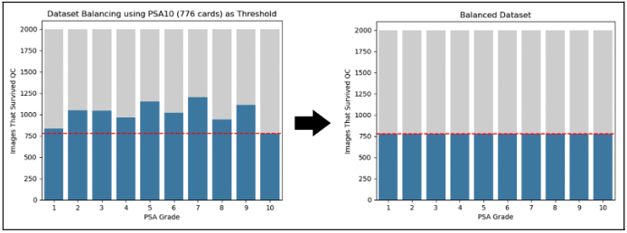

# Neural Network Model Building

- ResNet-50 feeds into three fully connected ReLU dense layers [1024, 512, 128]  
- The dense layers feed into a single softmax prediction layer  

Two rounds of training were done:
- First Round: 15 epochs, freeze first 20 layers of ResNet-50
- Second Round: 15 epochs, unfreeze all layers
  
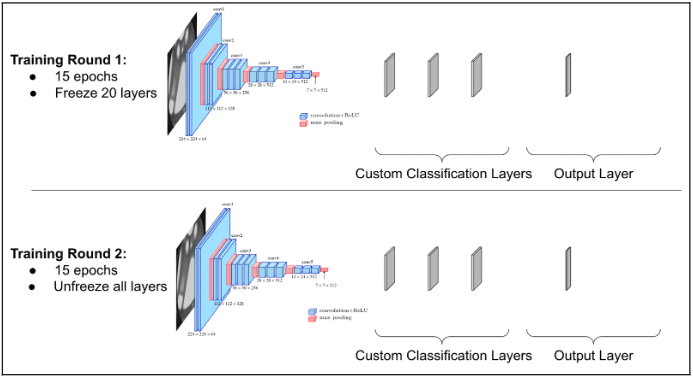

# Exploratory Data Analysis
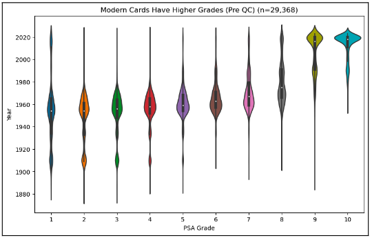
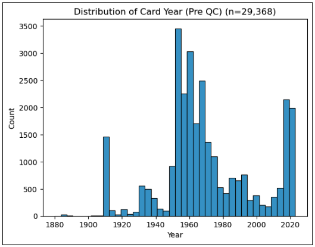
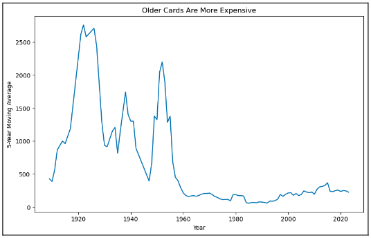

# Descriptions of Files in Repo
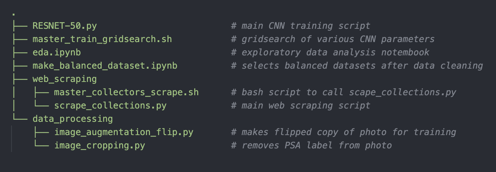

