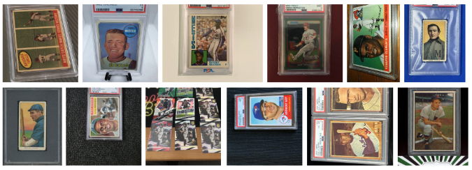

<h1 align="center">Automated Grading of Baseball Trading Cards using Convolutional Neural Networks</h1>  

### Authors:  
- Brian Miller (brian.s.miller@du.edu)
- Sean Wendlandt (sean.wendlandt@du.edu)

### Project Overview:
The condition of a trading card significantly influences its worth. However, the current methods to assess a card's condition are insufficient. Non-professionals often lack the accuracy required for card grading, and obtaining professional evaluations is too expensive and time-consuming.

This project aims to automate the card grading process using machine learning. Our neural network utilizes the pretained model ResNet-50 
combined with custom classification and output layers. 

**Data Preprocessing Steps:**
- Web scraping to obtain data
- Manual removal of innacurate data
- Dataset balancing
- Automated removal of PSA label
- Standardize photo dimensions for CNN

### Description of CNN:

- ResNet-50 feeds into three fully connected ReLU dense layers [1024, 512, 128]  
- The dense layers feed into a single softmax prediction layer  

Two rounds of training were done:
- First Round: 50 epochs, freeze first 30 layers of ResNet-50
- Second Round: 50 epochs, unfreeze all layers

### Data:
All 10k cards were downloaded from [Collectors.com](https://www.collectors.com/trading-cards/sport-baseball-cards/20003?lowgrade=1&highgrade=10&gradingservice=2&page=1)

### Description of Files:  

